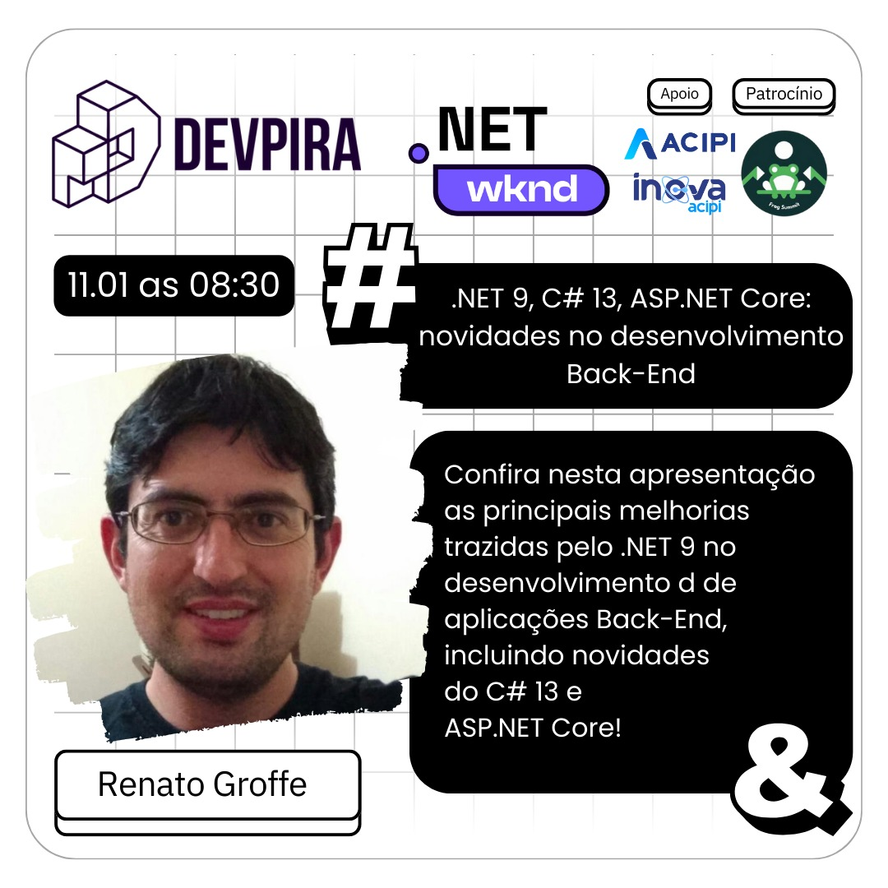
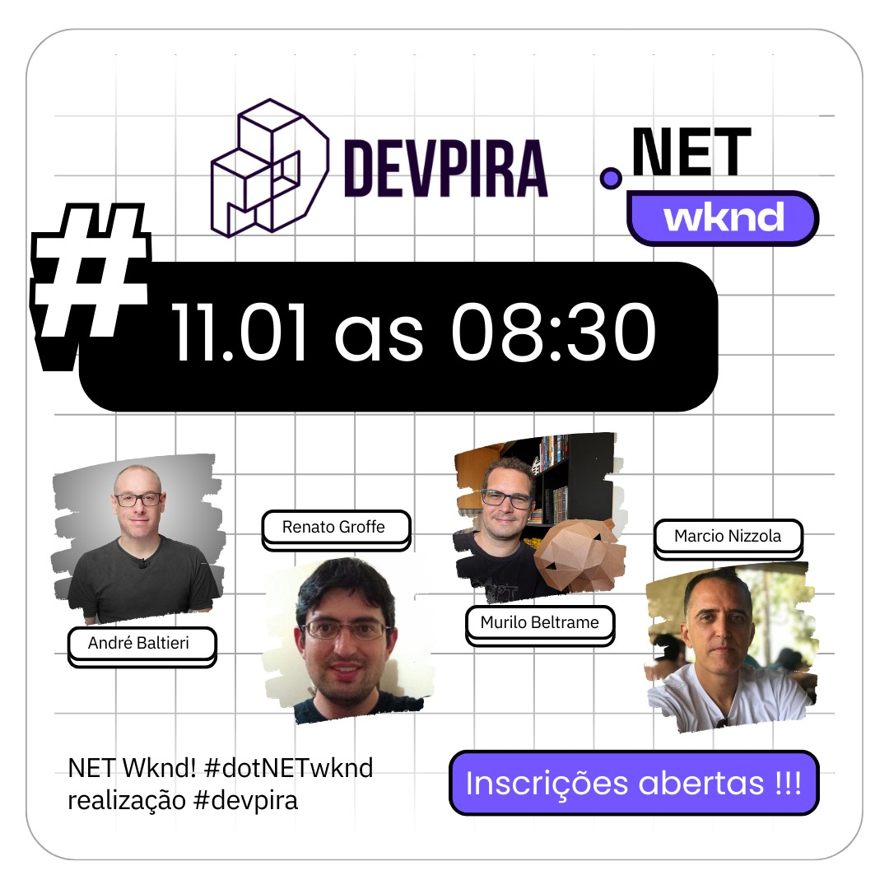

# DotNet9_DEVPIRA-2025-01
 Conteúdos sobre .NET 9 de apresentação realizada em 11/01/2025 para membros da comunidade DEVPIRA. 

---

Título da apresentação: **NET 9, C# 13, ASP.NET Core - Novidades no Desenvolvimento Back-End**

Data: **11/01/2025 (sábado)**

Tecnologias e tópicos abordados: **.NET 9, ASP.NET Core, C# 13, Visual Studio Code, Windows, Linux, OpenAPI, Azure, Docker, Redis...**

Evento: **DEVPIRA Wknd Capivari 2025**

Número de participantes: **42 pessoas**

Link de divulgação: [**Instagram**](https://www.instagram.com/p/DEpTHOBzjWE/)

Local: **Inova ACIPI - Rua Prudente de Moraes, 463 - Centro - Piracicaba-SP - CEP: 13400-310**

Deixo aqui meus agradecimentos ao **Alexandre Ballestero**, ao **Fábio Baldin**, ao **Murilo Beltrame** e demais organizadores por todo o apoio para que eu partipasse como palestrante de mais um evento promovido pela comunidade **DEVPIRA**.

---

